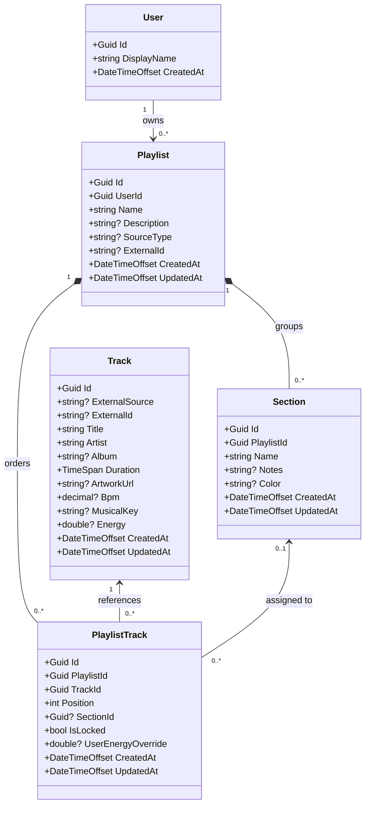
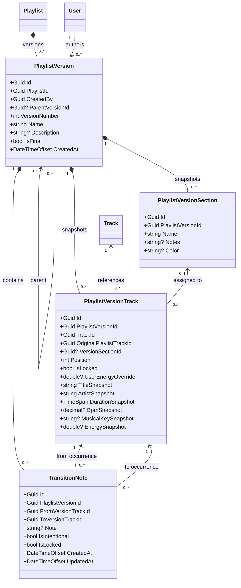
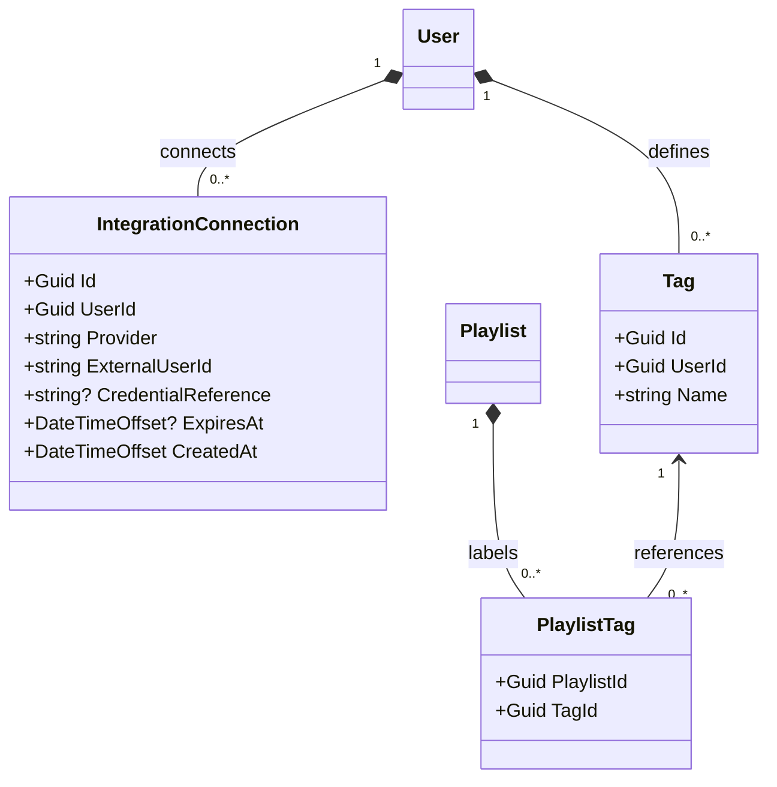

# Playlist Flowbench — initial domain class diagram

Database planning baseline · 9 October 2026

Based on `docs/context.md` §§11–14 and §§31–38 and the existing Blazor prototype. This is a UML class model for planning persistence. **Core classes below are implemented in this change; the expansion diagram is planned work.** Existing `Models/PlaylistSummary.cs` and `Models/PlaylistOverview.cs` remain presentation read models.

## 1. Implemented core

`?` means nullable; `Guid` identifies entities; timestamps use UTC `DateTimeOffset`. Multiplicities describe the intended persisted relationships. Nullable navigation properties permit objects to be loaded without their related objects; they do not make required foreign-key relationships optional. Collection navigation properties are represented by association lines.

### Why these classes come first

- **User:** an ownership profile, with no password or token fields. Integrate with ASP.NET Core Identity later, explicitly mapping the authenticated identity to the domain owner.
- **Playlist:** editable arrangement metadata and ownership.
- **Track:** normalized song metadata, independent of music-service adapters.
- **PlaylistTrack:** a specific occurrence of a song. A playlist may repeat the same `TrackId`; each occurrence has its own ID and position.
- **Section:** a named contiguous run of occurrences. Membership and playback order determine its boundaries.

These are initial POCO models. They do not yet enforce validation, ownership, locking, ordering, or navigation consistency. Application/domain operations and database mappings must implement the rules below before accepting persisted edits.

## 2. Planned versioning and transition classes

The core `Playlist`, `User`, and `Track` boxes are references to the implemented classes above. All other classes in this diagram are **planned**, not included in the initial model commit.

Versioning decisions to implement together:

- Add nullable `Playlist.CurrentVersionId` when the version model lands; it must refer to a version of that same playlist. It identifies the selected saved baseline. The core playlist occurrences hold working edits.
- `PlaylistVersionSection` extends the conceptual specification so saved sections cannot change when working sections are renamed or deleted.
- Transition endpoints refer to **version occurrence IDs**, refining the spec's ambiguous `FromTrackId` / `ToTrackId`. This distinguishes repeated songs. Endpoints must belong to the same version and be adjacent in its linear order.
- Working transition edits can live in editor state and be persisted into a draft version on save/autosave. A future draft-persistence operation must atomically snapshot tracks, sections, and transition notes.
- `OriginalPlaylistTrackId` is a provenance value, **not a foreign key** to a mutable occurrence that may later be deleted. It supports comparison across versions.
- Snapshot fields preserve historical display/analysis values when shared metadata changes. Track references must not cascade-delete history; prefer archiving shared tracks.
- Finalized snapshots are immutable. Editing a final version creates a new draft with `ParentVersionId`; parent and child must share the same playlist.
- BPM and energy deltas are calculated from adjacent occurrences. They are observations and are not stored as quality scores.

## 3. Planned integration and tagging classes

All classes except `User` and `Playlist` below are planned.

`CredentialReference` points to protected server-side credential storage; it is not a plaintext OAuth token. Tags are user-scoped. A playlist can only use its owner's tags. Music providers remain behind adapters; source identifiers are metadata, not editor behavior.

## 4. Database design checklist

| Area | Intended constraint or mapping |
| --- | --- |
| IDs | Entity `Id` is the primary key. `PlaylistTag` later uses `(PlaylistId, TagId)` as its composite primary key. |
| Ownership | `Playlist.UserId` is required. Authorize every operation against the authenticated owner. |
| Sequence | Unique `(PlaylistId, Position)`, positions start at 1 and are contiguous. Reordering must be transactional and avoid temporary uniqueness conflicts. Never enforce unique `(PlaylistId, TrackId)`. |
| Sections | A nullable section association allows ungrouped tracks. Enforce that the section and occurrence share a playlist, preferably with a composite foreign key `(SectionId, PlaylistId)` to `(Id, PlaylistId)`. Section membership must form a contiguous run. |
| Metadata | Nonblank names/titles/artists; nonnegative duration; positive BPM when supplied; energy and overrides in `[0, 1]`. Unknown BPM, key, and energy stay null, never zero placeholders. |
| Energy | Effective energy is `UserEnergyOverride ?? Track.Energy`; calculate it after loading metadata. Do not duplicate it in a persisted column. |
| Sources | Source and external ID should be either both provided or both absent. Select provider-specific identity/uniqueness rules when adapters are implemented; manual tracks need no external ID. |
| Numeric storage | Map duration to integer ticks or milliseconds explicitly; choose precision for BPM. Avoid provider-dependent SQL time-of-day mappings for elapsed duration. |
| Deletion | Playlist deletion removes its occurrences/sections; shared tracks survive. Section removal unassigns occurrences in a transaction. Restrict referenced track deletion; preserve version history. Configure cascade paths explicitly. |
| Locking | Reorder/delete operations must respect `IsLocked`; setters alone do not enforce it. Define transition-lock behavior alongside version operations. |
| Versions | Unique `(PlaylistId, VersionNumber)` and `(PlaylistVersionId, Position)`; validate same-version section/endpoints and same-playlist parent/current-version references. |
| Transition notes | At most one note per `(PlaylistVersionId, FromVersionTrackId, ToVersionTrackId)`. Invalidate or explicitly remap notes when draft adjacency changes. |
| Timestamps/concurrency | Update `UpdatedAt` in write operations. Add a database-appropriate optimistic-concurrency token before enabling persistence/autosave. |
| Derived UI | Track counts, formatted durations, BPM ranges, energy curves, and relative edited labels belong in projections. Canvas coordinates/collapse state are future UI state, not playback order. |

## 5. Implementation path

1. **This change:** diagram and core `User`, `Playlist`, `Track`, `PlaylistTrack`, and `Section` classes in `src/PlaylistFlowbench/Domain/`.
2. Choose a relational database and add EF Core mappings, validation/ordering operations, ownership integration, and migrations. Add focused tests for domain rules at that stage.
3. Implement draft/version snapshots and transition persistence together, with atomic save and concurrency handling.
4. Map domain data into the existing presentation read models and replace `MockPlaylistRepository` with the persistence implementation.
5. Add provider adapters, protected credentials, and tagging as their features are developed.

No database provider, migration, authentication implementation, or new package is introduced by this initial change.
